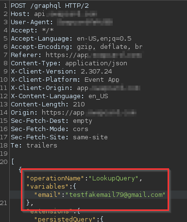

# How i found Email Enumeration

I was search for some endpoints on this GraphQL API, and then just made a request to login, before the login it verifies if the email exists and after it verifies the credentials

If the email exists the API returns this message

When the email doesn’t exists it returns false and it can or cannot have a password

In this case i used my other email that was not registered

The response is false

To mitigate this vulnerability we could simply hide the message and don’t send it to the client
