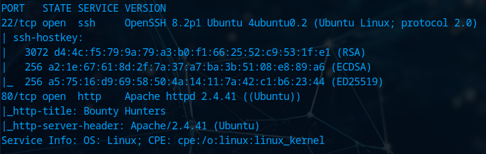

# BountyHunter

# Recon

## PortScan

`nmap -sCV -T4 -oN nmap 10.10.11.100`

Lets add the IP to our hosts file

`echo -e "10.10.11.100\tbounty.htb" >> /etc/hosts`

## Web

### Source Code

Found the page `mail/contact_me.php`

### Bounty Report System

After sending a random report we capture it inside BurpSuite and there is a base64 value

Base64 code

When we decode there is some `XML` code so maybe some `XXE` vulnerability

### XXE with LFI

Now we know that there is XML so we try to manipulate the data parameter, copy the valid code and lets make some changes, in this case i want to get the passwd file

Put that code on the data parameter and send

### PHP Wrapper

Now we want to read PHP files, there was a `db.php` file and to read it we used a php wrapper with XXE

`<!ENTITY x SYSTEM "php://filter/convert.base64-encode/resource=db.php">`

After encode it the same way send it and you should see something like this

Now when we decode it as base64 we get the contents of the file

`dbname = "bounty";
username = "admin";
password = "m19RoAU0hP41A1sTsq6K";`

## Privilege Escalation

### SSH

We cloud read the `passwd` file earlier and we found user `development` and `root`, now that we have the password lets connect as user development

`ssh development@bounty.htb`

### Internal Tool

Running the tool

`python3 [ticketValidator.py](http://ticketvalidator.py/)`

`invalid_tickets/390681613.md`

What we can run as root

`sudo -l`

`sudo /usr/bin/python3.8 /opt/skytrain_inc/ticketValidator.py`

After some time playing around with the python script found this line to get pass inside the `eval function`

On the ticket file we need to set this value to 11 so 11/7 gives a remainder of 4 and that if gonna be true and we are getting the function eval

To test for it i just did this `import date`

And we get the date it means the python is reading our code

Now lets create a new `.md` file inside the target machine

`touch /tmp/test.md`

`vi /tmp/test.md`

And now we are `root` user

