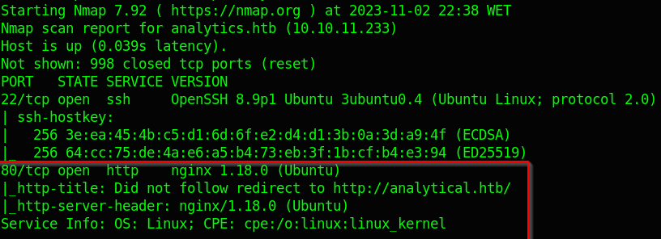

# HTB - Analytics

## Recon

Gain much information as you can to hack the machine

### Port scanning

`nmap -sC -sV -oN nmap $Machine-IP` Does a port scanning with default scripts, show the version of the services and saves the output as `nmap`

Here we can see that redirects to `analytical.htb` so we put that to `/etc/hosts`

### Sudomain enumeration

Subdomain fuzzing changing the `FUZZ` by the single word inside the wordlist filtering the lines to 8 so doesn’t spam the errors

`ffuf -u http://analytical.htb/ -H "Host: FUZZ.analytical.htb" -w /usr/share/wordlists/assetNotes/subdomain.txt -fl 8`

## Subdomain data.analytical.htb

As we look at this page we search for an exploit for this and we found this **`CVE-2023-38646`**

### CVE-2023-38646

The token used can be found on this endpoint `http://data.analytical.htb/api/session/properties`

[https://github.com/m3m0o/metabase-pre-auth-rce-poc](https://github.com/m3m0o/metabase-pre-auth-rce-poc)

After that used some reverse shell to get access to the machine, in this case i used `bash`

Got access to the machine

## Escalating privileges

### Recon

Looking at environment variables using `env` we got some credentials

After that login into the machine using those creds

Here we are looking for some escalation point, like an exploit for the ubuntu version

Downloaded the exploit and compile inside my local machine and then send it to the victim

By running the exploit we got root

