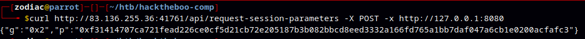

# Crypto Hybrid Unifier

`curl [http://83.136.255.36:41761/api/request-session-parameters](http://83.136.255.36:41761/api/request-session-parameters) -X POST -x [http://127.0.0.1:8080](http://127.0.0.1:8080/)`



{"g":"0x2","p":"0xf31414707ca721fead226ce0cf5d21cb72e205187b3b082bbcd8eed3332a166fd765a1bb7daf047a6cb1e0200acfafc3"}

Compute and send Client Public Key

```bash
import subprocess
from Crypto.Util.number import bytes_to_long, long_to_bytes
import random

# Parameters from the server response
g = 0x2
p = 0xf31414707ca721fead226ce0cf5d21cb72e205187b3b082bbcd8eed3332a166fd765a1bb7daf047a6cb1e0200acfafc3

# Generate a random private key
client_private_key = random.randint(1, p - 1)

# Compute the client public key as an integer
client_public_key = pow(g, client_private_key, p)

# Debugging: Print client public key to verify
print("Client Public Key (int):", client_public_key)

# Use curl to send the public key in integer format
curl_command = [
    "curl", "-X", "POST", "http://83.136.255.36:41761/api/init-session",
    "-H", "Content-Type: application/json",
    "-d", f'{{"client_public_key": {client_public_key}}}',  # Note: client_public_key is not in quotes
    "-x", "http://127.0.0.1:8080"
]

# Execute the curl command
subprocess.run(curl_command)

```


```bash
Client Public Key (int): 16697461139088893954739767469921575496787024106633749664232945533190456432138056675405106668272471011193604632520116
{"server_public_key":"0x29ebd44452f00e594a886f0ce4604be3db319a61d1c1f3835551f75610deaa34fd159f3232c9ccd2cfff8ce38f7feb53","status_code":200,"success":"A secure session was successfully established. There will be E2E encryption for the rest of the communication."}
```

Request an Encrypted challange

`curl -X POST [http://83.136.255.36:41761/api/request-challenge](http://83.136.255.36:41761/api/request-challenge) \
-H "Content-Type: application/json" \
-x [http://127.0.0.1:8080](http://127.0.0.1:8080/)`


`{"encrypted_challenge":"vFe7yhdjzknzd5mnsNfrweut1yjcC8eHY7LCYnsWt/kbThnvFWbZe7szwWv2HRh8"}`

All in one script

```bash
import requests
from Crypto.Util.number import getPrime, inverse, long_to_bytes
from Crypto.Random import random
from hashlib import sha256
from Crypto.Cipher import AES
from Crypto.Util.Padding import pad, unpad
import base64
import os
# Base URL for the server
BASE_URL = 'ip:port'
# Step 1: Request Diffie-Hellman parameters from the server
def request_session_parameters():
    response = requests.post(f'{BASE_URL}/api/request-session-parameters')
    params = response.json()
    g = int(params['g'], 16)
    p = int(params['p'], 16)
    return g, p
# Step 2: Initialize session and establish session key
def init_session(g, p):
    # Generate client private and public keys
    client_private = random.randint(2, p - 2)
    client_public = pow(g, client_private, p)
   
    response = requests.post(f'{BASE_URL}/api/init-session', json={
        'client_public_key': client_public
    })
   
    result = response.json()
    if result['status_code'] == 200:
        server_public_key = int(result['server_public_key'], 16)
        session_key = pow(server_public_key, client_private, p)
        return sha256(str(session_key).encode()).digest()
    else:
        raise Exception(result.get('error', 'Session initialization failed'))
# Step 3: Request encrypted challenge
def request_challenge():
    response = requests.post(f'{BASE_URL}/api/request-challenge')
    return response.json()['encrypted_challenge']
# Step 4: Authenticate and request flag
def access_secret(session_key, encrypted_challenge):
    # Decrypt the challenge
    decoded_challenge = base64.b64decode(encrypted_challenge)
    iv, encrypted_data = decoded_challenge[:16], decoded_challenge[16:]
    cipher = AES.new(session_key, AES.MODE_CBC, iv)
    challenge = unpad(cipher.decrypt(encrypted_data), 16)
    challenge_hash = sha256(challenge).hexdigest()
    # Encrypt packet with 'flag' action
    action = 'flag'
    iv = os.urandom(16)
    cipher = AES.new(session_key, AES.MODE_CBC, iv)
    encrypted_packet = iv + cipher.encrypt(pad(action.encode(), 16))
    encrypted_packet_b64 = base64.b64encode(encrypted_packet).decode()
    # Send the packet to request the flag
    response = requests.post(f'{BASE_URL}/api/dashboard', json={
        'challenge': challenge_hash,
        'packet_data': encrypted_packet_b64
    })
    flag_response = response.json()
   
    # Decrypt and return the flag
    flag_packet = flag_response['packet_data']
    flag_packet = base64.b64decode(flag_packet)
    iv, encrypted_flag = flag_packet[:16], flag_packet[16:]
    cipher = AES.new(session_key, AES.MODE_CBC, iv)
    flag = unpad(cipher.decrypt(encrypted_flag), 16)
    return flag.decode()
# Client execution
try:
    g, p = request_session_parameters()
    session_key = init_session(g, p)
    encrypted_challenge = request_challenge()
    flag = access_secret(session_key, encrypted_challenge)
    print("Flag:", flag)
except Exception as e:
    print("An error occurred:", e)
```
