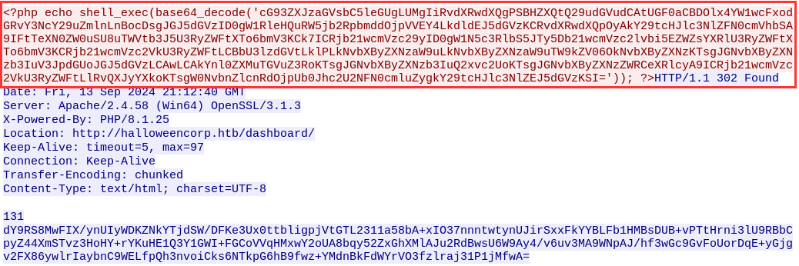

# Forensics Foggy Instrusion

Download the wireshark `.pcap` file and there is a an attack that the hacker can read the local files



Once you decode the base64 code there is the `C:\xampp\htdocs\config.php` file


Decoding the response code, the response is the contents of `config.php` file


Use this code to decrypt the response

```bash
import base64
import zlib

# Base64-encoded response data (the content you received after "131" in the response body)
encoded_data = '''
dY9RS8MwFIX/ynUIyWDKZNkYTjdSW/DFKe3Ux0ttbligpjVtGTL2311a58bA+xIO37nnntwtynUJirSxxFkYYBLFb1HMBsDUB+vPTtHrni3lU9RBbCpyZ44XmSTvz3HoHY+rYKuHE1Q3Y1GWI+FGCoVVqHMxwY2oUA8bqy52ZxGhXMlAJu2RdBwsU6W9Ay4/v6uv3MA9WNpAJ/hf3wGc9GvFoUorDqE+yGjgv2FX86ywlrIaybnC9WELfpQh3nvoiCks6NTkpG6hB9fwz+YMdnBkFdWYrVO3fzlraj31P1jMfwA=
'''

# Step 1: Base64 decode
compressed_data = base64.b64decode(encoded_data)

# Step 2: Decompress the data using zlib
decompressed_data = zlib.decompress(compressed_data, wbits=-zlib.MAX_WBITS)

# Step 3: Convert bytes back to string (UTF-8 encoded)
decoded_content = decompressed_data.decode('utf-8')

print(decoded_content)

```

Decoded `config.php`


