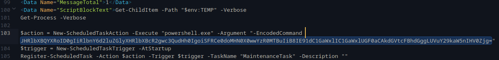

# Forensics Ghostly Persistence

To read the windows events install the evtx tool

`pip3 install python-evtx`

Converting to .xml format

`evtx_dump.py Microsoft-Windows-PowerShell_Operational.evtx > MWSP.xml`

Decode the string from base64

Decoded value

