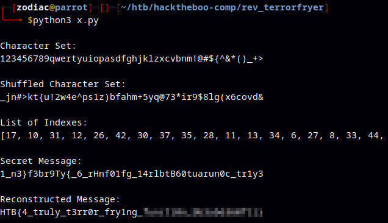

# Reverse Terrorfryer

```bash
def locate_indexes(character_set, input_string):
    position_list = [' '] * len(input_string)
    for idx in range(len(character_set)):
        position = input_string.find(character_set[idx])
        if position != -1:
            position_list[idx] = position
        else:
            position_list[idx] = None  # If the character is not found in the string
    return position_list

def rebuild_string(indexes, character_set):
    constructed_string = ''
    for index in indexes:
        constructed_string += character_set[index]
    return constructed_string

# Define character set and shuffled string
character_set = "123456789qwertyuiopasdfghjklzxcvbnm!@#${^&*()_+>"
print("\nCharacter Set:\n" + character_set + '\n')
shuffled_set = "_jn#>kt{u!2w4e^ps1z)bfahm+5yq@73*ir9$8lg(x6covd&"
print("Shuffled Character Set:\n" + shuffled_set + '\n')

# Get the indexes of characters from the character set in the shuffled string
indexes_result = locate_indexes(character_set, shuffled_set)
print("List of Indexes:")
print(indexes_result)
print()

secret_message = "1_n3}f3br9Ty{_6_rHnf01fg_14rlbtB60tuarun0c_tr1y3"
print("Secret Message:\n" + secret_message + '\n')
ordered_message = rebuild_string(indexes_result, secret_message)
print("Reconstructed Message:\n" + ordered_message + '\n')
```

`python3 x.py`


