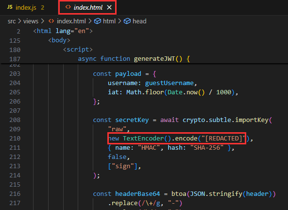

# Web WayWitch

Since we have the source code we can inspect how the JWT is handle, and inside the client-side they provide in clear-text the secret.

Inspect the default page and view the JS code.

Now that we have the JWT secret copy your current JWT to make some modifications

[https://jwt.io/](https://jwt.io/)

Make sure you paste the secret and modify your user to `admin`

If the token is valid and we are admin the function `get_tickets()` is executed and it will retrieve all tickets

The data retrieved is this with the flag

Paste the new JWT and navigate to `/tickets`

