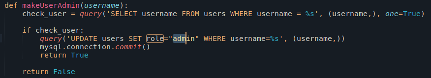

# HTB Hack the boo 26/10/2023

## Web challange

### Function AddAdmin

The website can add a user to admin by using `JSON` and `SQL`

API endpoint that changes the role to admin `localhost:1337/api/addAdmin`

As we make the request of `localhost:1337/api/addAdmin?username=user` it gives 403

I tried to bypass it by changing the Headers but still the same, after that i saw there was a restriction

- It has to be from localhost and bypassed a **blacklist**

### Function downloadManual

It makes a request based on the URL put inside the `Manual URL`

- Can’t use `127.0.0.1`, `localhost`, `0.0.0.0`

This is a SSRF vuln, we can access the [localhost](http://localhost) via frontend in this case the `Manual URL`

As we put the URL, it validates then makes a request to it

### Payload

- 127.1 = 127.0.0.1
- `http://127.1:1337/api/addAdmin?username=a`

When we put this payload inside Manual URL it changed the role of my user to admin, giving the flag

