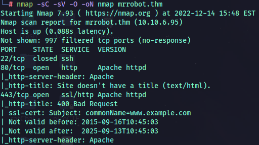

# MrRobot

## Recon

### Port Scan

`nmap -sC -sV -O -oN nmap mrrobot.thm`

Found a wordlist

`ffuf -w /usr/share/wordlists/dirbuster/directory-list-2.3-medium.txt -u http://mrrobot.thm/FUZZ -fs 1188 -o directory.dir`

By trying we could enumerate the username very easy

By finding the wordlist behind we can use hydra to brute-force the password

After getting the password

Reverse shell in a page that doesn’t exists, so when its loads the page `.404` it runs the shell

### Linux privilege escalation

Linux 3.13.0-55-generic ubunto x86_64

Ubuntu 4.8.2-19

`cat /etc/passwd`

Find files with SUID

`find / -type f -perm -4000 2>/dev/null`

Found nmap on SUID perm

