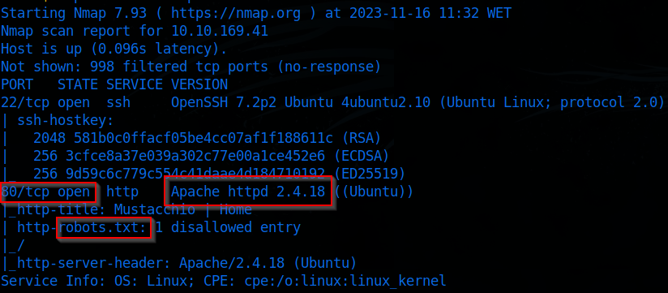

# Mustacchio

Description: XXE Vulnerability that allow us to get the id_rsa key and login to the server, inside the server there was a SUID file running, by manipulating the PATH var it gave us ROOT

# Recon

## Port scanning

`nmap -sCV -oN nmap 10.10.169.41`

Before we start exploring the webpage let’s add mustacchio to our `/etc/hosts`

## Web

Now that we are doing web recon let’s open our burp suite and make some requests.

### Setting up Burp

Start a new project

Put the URL inside the scope that we are attacking

Here we are filtering the HTTP history of our burp suite to only show in-scope items

### Exploring the website

As we are looking at the source code we find this strange directory

Found a file named users.bak

### SQL credentials

Finding the hash using `haiti`

Decoding the password

`john hash --format=raw-sha1 --wordlist=/usr/share/wordlists/rockyou.txt`

We tried to do ssh login using the credentials but we got premisson denied from the server

I did more recon and found this

### Web ( port 8765 )

Now we have an admin panel

After we login we get this page

As we are searching more things on the page we find this message

That key maybe he is reffering to that file above “`dontforget.bak`”

When we enter to that link we download the file and now there is a entry point

When we inspect the text area we can see the `ID` and its named as `BOX` so with this we can inject XML here

## Exploiting web (8765)

So now we know that we can inject XML inside this textarea lets put a random string to check how it reacts

We have this `xml` parameter

Now lets try to add a comment, using the `dontforget.bak` file we can get the XML structure,

### Escalating XXE

By putting this payload

We get `/etc/passwd` file but we need more than that

### Getting the SSH key

We know there is a user named `barry` so lets get the ssh key

Now we save it to a file and use `ssh2john` to make a hash and after we decode it

### Decoding

I downloaded `ssh2john` using `wget https://raw.githubusercontent.com/magnumripper/JohnTheRipper/bleeding-jumbo/run/ssh2john.py`

Now we can run it `python ssh2john.py /home/zodiac/thm/mustacchio/id_rsa > id_rsa.hash`

And we get the `id_rsa.hash` now we send it to `john`

Now we connect using the key and the passphrase with ssh

`ssh -i id_rsa barry@mustacchio.thm`

First flag

# Privilege Escalation

## Recon

### Linux version

`uname -a`

Linux mustacchio 4.4.0-210-generic

Interesting file found by `find / -type f -perm -4000 2>/dev/null`

### Exploitation

Read the file `strings live_log`

The script is using `tail`, so we can manipulate the `tail`

Go to `/tmp` and create a script named as `tail`

Put this code, this will copy  the bash and send to our `/tmp` directory and changes the permissions

Now we change the PATH variable so it runs our `tail` script

Make it executable and run the `live_log`

`bash -p`

### Root Flag

