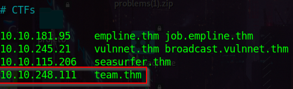

# THM - Team

## Starting

Add the machine ip to /etc/hosts

## Recon

Finding much information as we can

### Port scan

Scan using scripts and find service version, then save the output as “nmap” of the domain team.thm

`nmap -sC -sV -oN nmap team.thm`

### Finding Web Directories ( 80 )

Uses a wordlist to do a subdomain discover filtering 374 lines because its the error pattern 

`ffuf -u http://team.thm/ -H "Host: FUZZ.team.thm" -w /usr/share/wordlists/assetNotes/subdomain.txt -fl 374`

Found 3 subdomains but probably only 2 work

Adding to `/etc/hosts`

## Dev.team.thm

Some parameter

LFI vulnerabilitie, that allow us to read other files from the system

When used the extention wappalyzer to look the the technology running there is apache running

I tried to make some log poisoning but couldn’t read the logs so we the next thing to do was searching the `team.thm`

## Team.thm

### Discovering directories

`ffuf -u http://team.thm/FUZZ -w /usr/share/wordlists/secLists/web/directory-list-lowercase-2.3-medium.txt -fw 140`

Forbidden but can be some files that we could read

Found script.txt

When we download the script.old we get FTP credentials

`ftpuser:T3@m$h@r3`

## FTP

Using the credentials found before we can login to FTP

Getting the file

Reading the file

That is some hint to LFI related to ID_RSA

When we made bruteforce on the LFI field `ffuf -u http://dev.team.thm/script.php?page=FUZZ -w /usr/share/wordlists/generic/LFI-linux.txt -fl 2`

There is some `SSH` files

Inside the `dev.team.thm` we can open that file and here we have the `id_rsa key`

Copy the text and open in some code editor

Now remove the comments and login with ssh

`ssh -i id_rsa dale@10.10.214.132`

## Getting next user

Here we saw that its possible to run the `admin_checks` file using the user gyles

Reading the file

While reading the code, we can run linux commands inside the file 

`sudo -u gyles /home/gyles/admin_checks`

After running the file the first input we can set something random and the next one i used `bash` and some command like `id` and we run everything as gyle

## Getting root

`cat .bash_history` to verify what has been done before us

### Interesting files

`/opt/admin_checks/script.sh` is running some files to make a backup, and its running as root

It’s running this `main_backup.sh` and we can change the content of it

Setting a reverse shell

Inside the atacker machine

Finishing the challange

