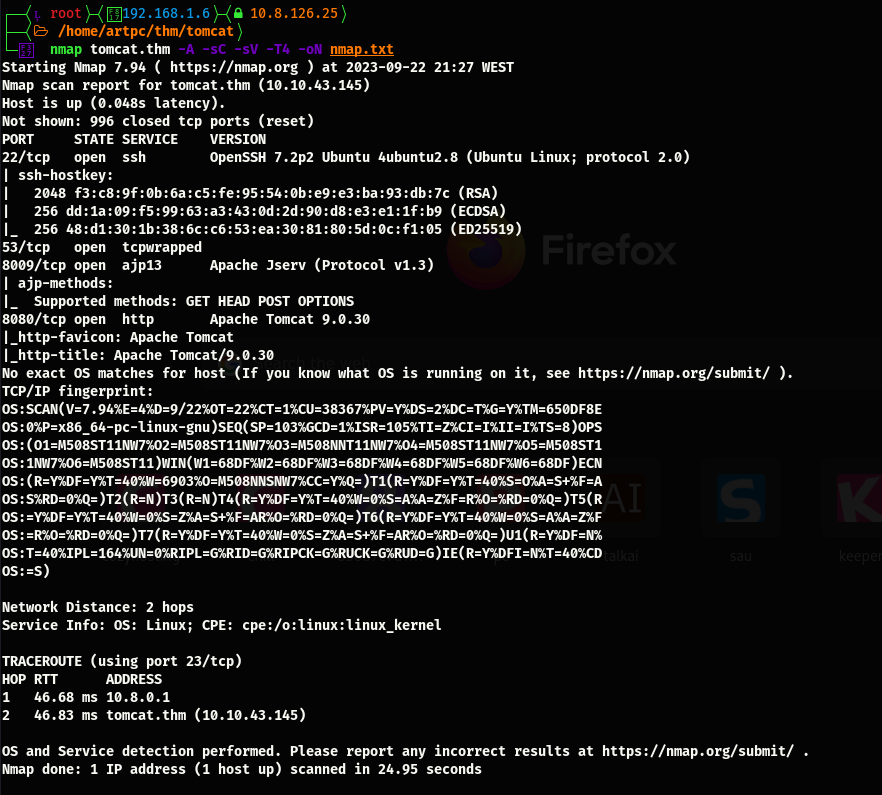

# Tomcat

## Recon

### Port Scan

`nmap tomcat.thm -A -sCV -T4 -oN nmap.txt`

## Web

Found tomcat exploit

### Tomcat exploit CVE-2020-1938

`python2 ex.py 10.10.43.143 -p 8009 -f WEB-INF/web.xml`

### SSH

Using the above credentials

### GPG Key’s

### Decrypt credentials.gpg

Change user to merlin

### ZIP as Sudo

### Root flag

We tried to decrypt root’s hash but it take some time, so while that we saw that we could run ZIP as root

